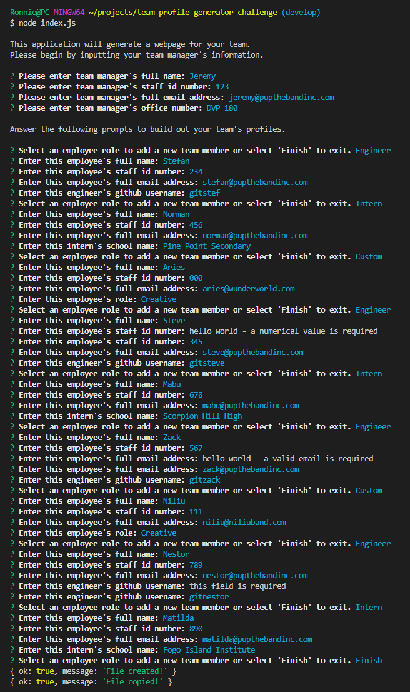

  # Team Profile Generator
   
    
  This application uses Node.js to generate a staff profile page, categorizing staff as managers, engineers, interns, or extended team members. A card is generated for each team member, listing the member's name, ID number, email, and an additional piece of information. This project was built using Test-Driven Development and Object Oriented Programming principles.
  
  ## Table of Contents
  * [Bonus Features](#features)
  * [Built With](#built)
  * [Installation](#installation)
  * [Usage Information](#usage)
  * [Authors & Acknowledgements](#credits)
  * [License](#license)
  * [Tests](#tests)
  * [Contact](#questions)
  
  ## Bonus Features
  This application allows for users to additionally generate custom team member profiles, under an "Extended Members" category. 
  This application also includes formatting validation for Inquirer prompts.

  ## Built With
  * HTML
  * CSS
  * JavaScript
  * Bootstrap
  * Node.js
  * NPM Inquirer
  * Jest
    
  ## Installation 
  After cloning the repository and ensuring that Node.js and npm Inquirer are installed, enter "node index.js" in the terminal to get started. After all the prompts have been answered, HTML and CSS files will be written to the "./dist" and "./dist/assets/css" directories.
  
  ## Usage Information
  This application has preset Manager, Engineer, and Intern categories. Custom team members will be assigned to the "Extended Members" category.  
  For index.html files generated with this application, the custom CSS stylesheet is linked using the standard "./assets/css/style.css" reference. For the "index-sample.html" file in this repository's root directory, this path has been manually edited to link to the "./src/style.css" path for easy preview.  
  Video walkthrough of how to use this application, [here](https://drive.google.com/drive/folders/1JYhoou6Zia4QPHW4leLDnAACOLoFw9SU?usp=sharing). 
    
    
    
  ## Authors & Acknowledgements
  As with all projects, external resources were consulted, but special thanks to: 
  Amitabh [here](https://gist.github.com/Amitabh-K/ae073eea3d5207efaddffde19b1618e8) for his regex email formatting validation. 
  Sayantini's article [here](https://www.edureka.co/blog/javascript-regex/) for the explainer on regex.  
  And [Erik](https://github.com/CodingErik) for his office hours pointers on how to refactor the promise chain in index.js to be more streamlined (also the reminder that switch statements exist).
  Made by [TOVTC](https://github.com/TOVTC). 
  Originally submitted 2022Apr26.
  
  ## License
  This application uses the MIT License. For more information regarding usage, please visit [this link](https://opensource.org/licenses/MIT).
  
  ## Tests
  Jest tests were conducted on all employee-class-based objects (employee, manager, engineer, intern, custom), to validate user input, object rendering, and data retrieval.
    
  ## Questions?
  Contact repository author via [GitHub](https://github.com/TOVTC). 
  
  ## Assignment Information - Object-Oriented Programming Challenge: Team Profile Generator
  ### User Story
  AS A manager 
  I WANT to generate a webpage that displays my team's basic info 
  SO THAT I have quick access to their emails and GitHub profiles

  ### Acceptance Criteria
  GIVEN a command-line application that accepts user input 
  WHEN I am prompted for my team members and their information 
  THEN an HTML file is generated that displays a nicely formatted team roster based on user input 
  WHEN I click on an email address in the HTML 
  THEN my default email program opens and populates the TO field of the email with the address 
  WHEN I click on the GitHub username 
  THEN that GitHub profile opens in a new tab 
  WHEN I start the application 
  THEN I am prompted to enter the team manager’s name, employee ID, email address, and office number 
  WHEN I enter the team manager’s name, employee ID, email address, and office number 
  THEN I am presented with a menu with the option to add an engineer or an intern or to finish building my team 
  WHEN I select the engineer option 
  THEN I am prompted to enter the engineer’s name, ID, email, and GitHub username, and I am taken back to the menu 
  WHEN I select the intern option 
  THEN I am prompted to enter the intern’s name, ID, email, and school, and I am taken back to the menu 
  WHEN I decide to finish building my team 
  THEN I exit the application, and the HTML is generated 