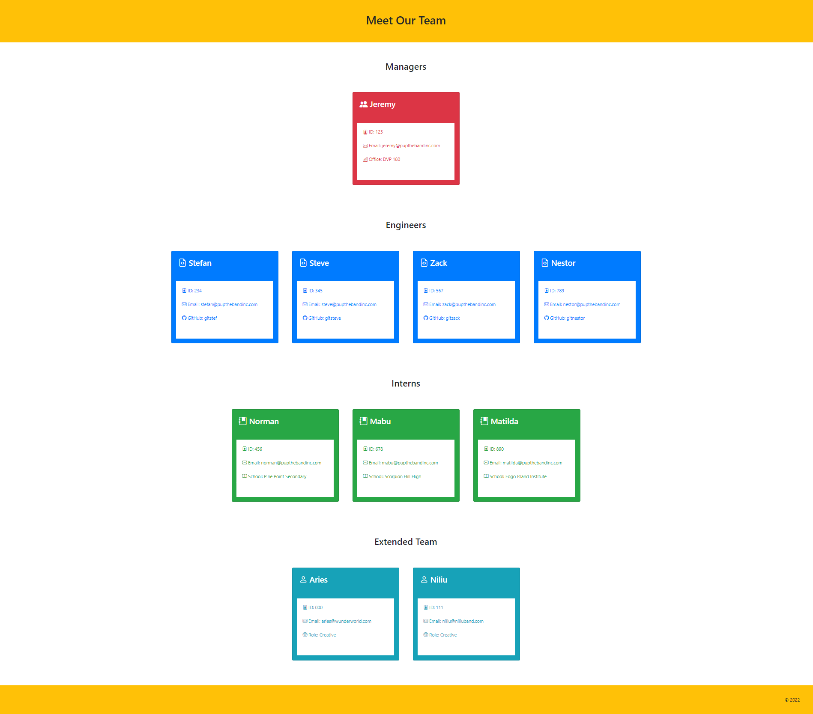

  # Team Profile Generator
    
    
  This application uses Node.js to generate a staff profile page, categorizing team members as managers, engineers, interns, or extended team members. A card is generated for each team member, listing the member's name, ID number, email, and an additional piece of information. This project was built using Test-Driven Development and Object Oriented Programming principles.
  
  ## Table of Contents
  * [Bonus Features](#features)
  * [Installation](#installation)
  * [Usage Information](#usage)
  * [Authors & Acknowledgements](#credits)
  * [License](#license)
  * [Tests](#tests)
  * [Contact](#questions)
  
  ## Bonus Features
  This application allows for users to additionally generate custom team member profiles, under an "Extended Members" category. 
  This application also includes formatting validation for Inquirer prompts.
    
  ## Installation 
  After cloning the repository and ensuring that Node.js and npm Inquirer are installed, enter "node index.js" in the terminal to get started. After all the prompts have been answered, HTML and CSS files will be written to the "./dist" and "./dist/assets/css" directories.
  
  ## Usage Information
  This application has preset Manager, Engineer, and Intern categories. Custom team members will be assigned to the "Extended Members" category. 
    
    
    
  ## Authors & Acknowledgements
  As with all projects, external resources were consulted, but special thanks to: 
  Amitabh [here](https://gist.github.com/Amitabh-K/ae073eea3d5207efaddffde19b1618e8) for his regex email formatting validation. 
  as well as Sayantini's article [here](https://www.edureka.co/blog/javascript-regex/) for the explainer on regex. 
  Made by [TOVTC](https://github.com/TOVTC).  
  Originally submitted 2022Apr26.
  
  ## License
  This application uses the MIT License. For more information regarding usage, please visit [this link](https://opensource.org/licenses/MIT).
  
  ## Tests
  Jest tests were conducted on all employee-class-based objects (employee, manager, engineer, intern, custom).
    
  ## Questions?
  Contact repository author via [GitHub](https://github.com/TOVTC). 
  